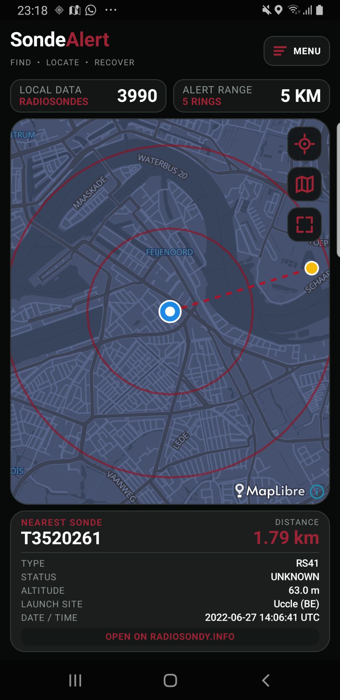
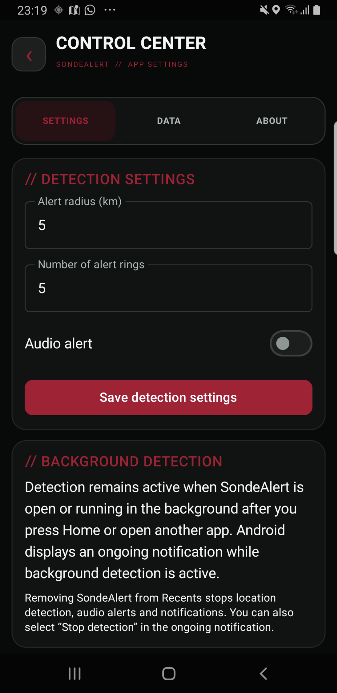
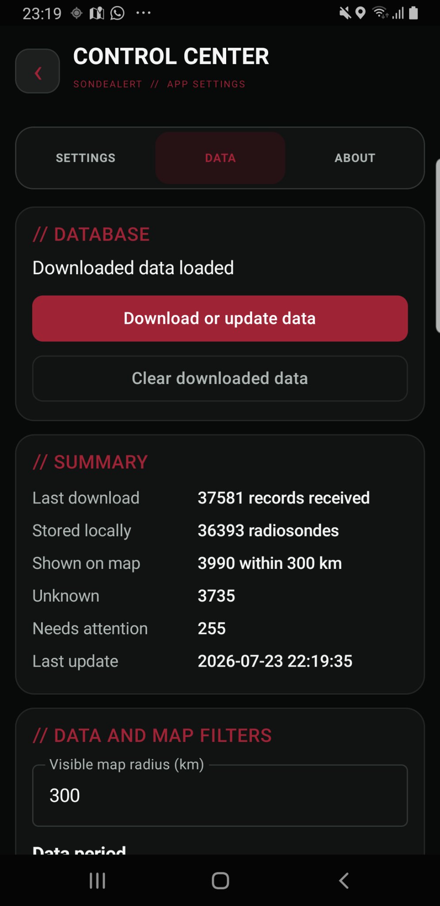
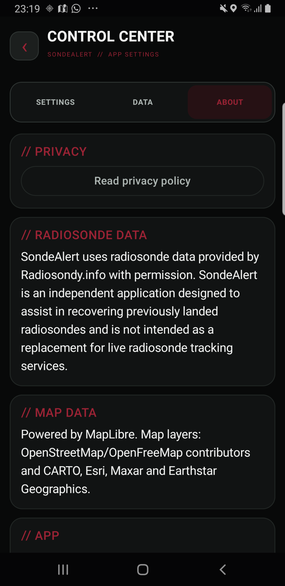
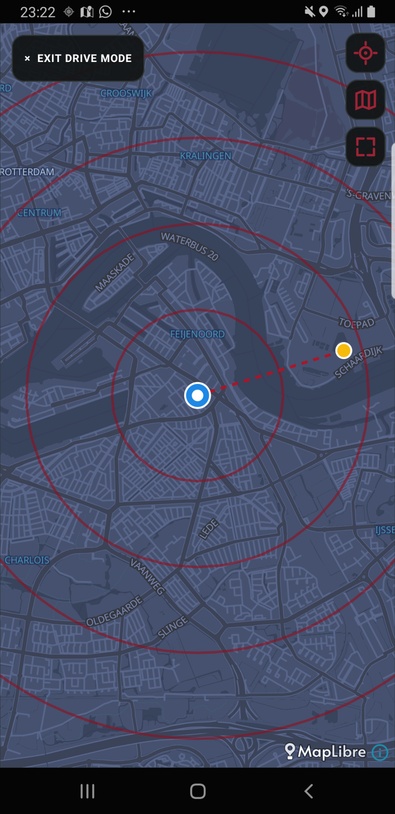

# SondeAlert

> **Find • Locate • Recover**

A modern Android application designed to help the radiosonde community locate and recover previously landed radiosondes.

---

## About

SondeAlert is a modern Android application built specifically for radiosonde hunters.

The app downloads radiosonde data for a selected area and stores it locally on your device. Using your current GPS location, SondeAlert helps you locate previously landed radiosondes through offline maps, intelligent distance alerts and powerful filtering options.

Unlike live tracking applications, SondeAlert focuses entirely on radiosonde recovery and field use.

---

## Features

- 📡 Offline radiosonde database
- 🗺️ Interactive MapLibre maps
- 📍 GPS-based sonde detection
- 🚗 Drive Mode
- 🔔 Intelligent distance alerts
- 📥 Local database storage
- 🔎 Radius-based filtering
- 🌙 Modern dark interface
- 🔗 Direct integration with Radiosondy.info
---

## Screenshots

---

## Availability

SondeAlert is currently under active development.

The first public release will be available as a free download on Google Play.

---

## Documentation

Additional information can be found here:

- 📖 Roadmap
- 📝 Changelog
- 🤝 Contributing
- 🔒 Security Policy
- ⚖️ License

---

## Credits

Developed by **Sc0ps Owl Designs**

SondeAlert would not be possible without the following projects and communities:

- Radiosondy.info
- MapLibre
- OpenStreetMap Contributors
- The worldwide radiosonde community
