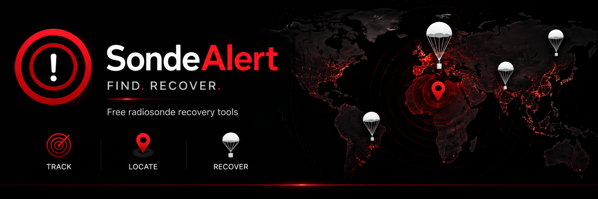
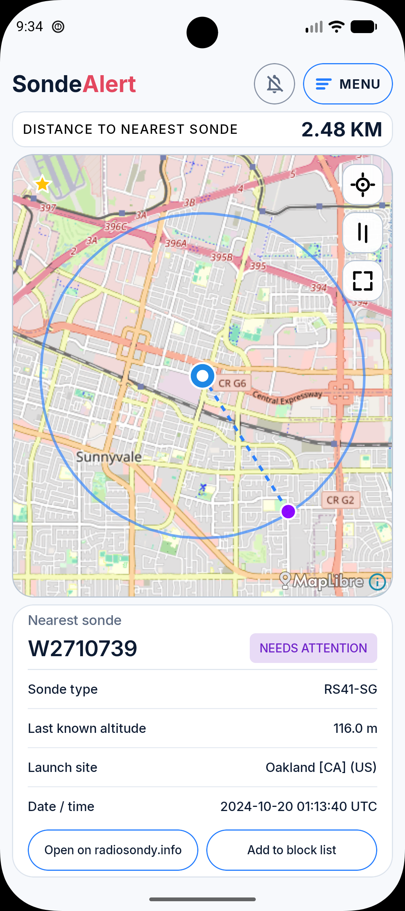
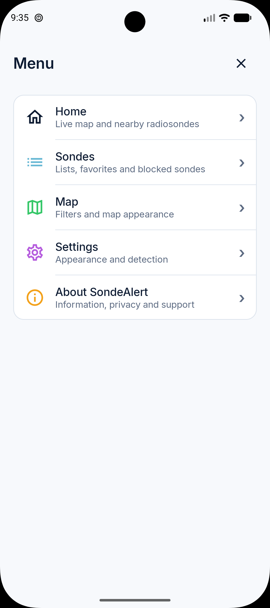
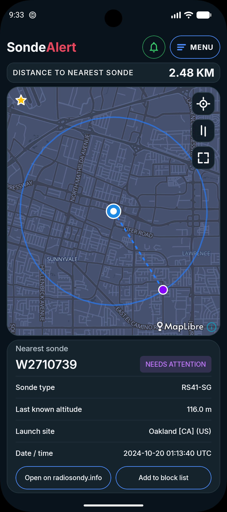
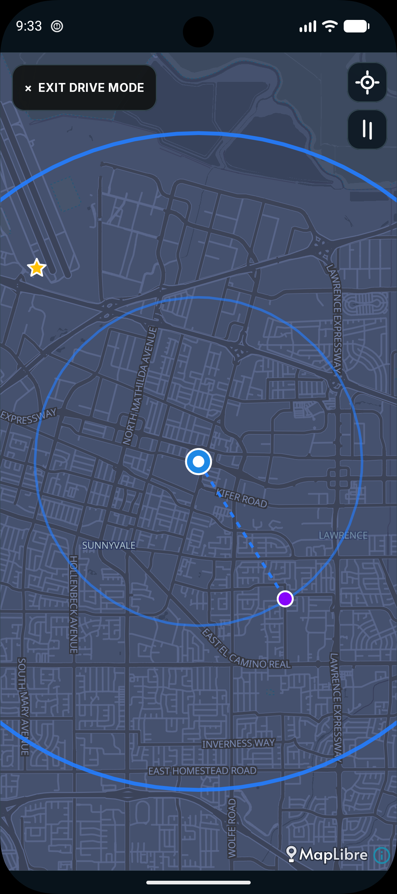
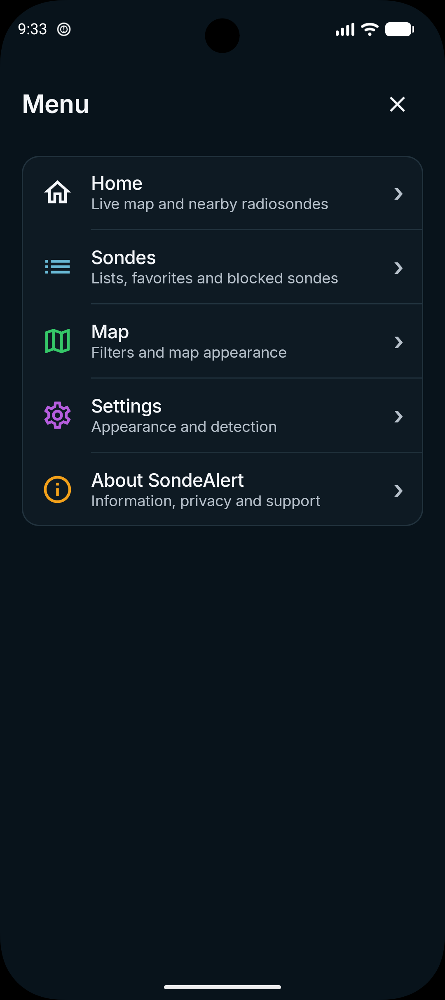
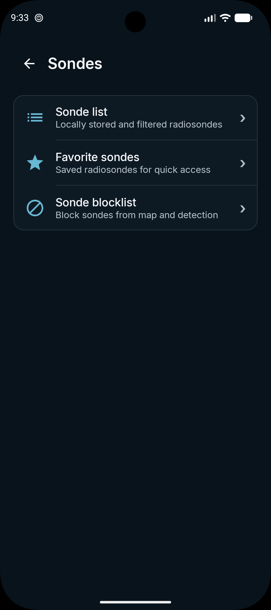
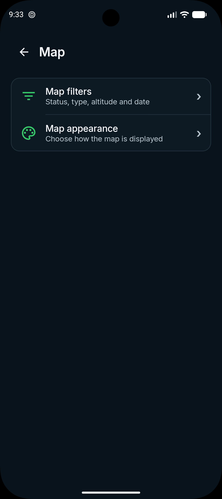
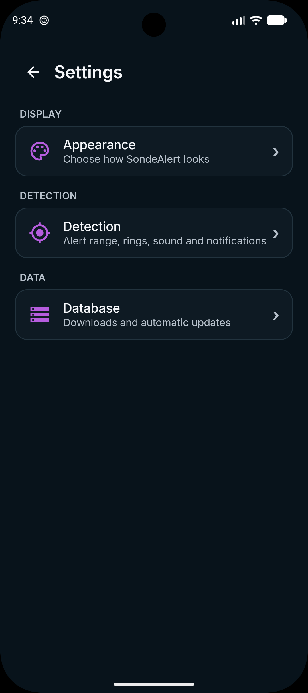
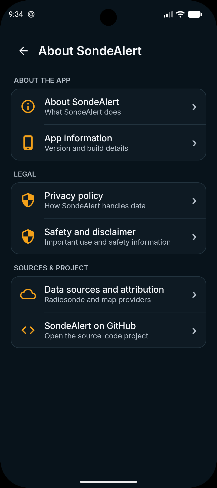

# SondeAlert

> **Find • Locate • Recover**

SondeAlert is an Android application designed to help the radiosonde community find and recover previously landed radiosondes.

---

## About SondeAlert

SondeAlert downloads radiosonde records for the area around your selected location and stores them locally on your device.

Using your current GPS position, the app calculates the distance to nearby radiosondes and can alert you when a sonde enters one of your configured detection rings.

Unlike live tracking applications, SondeAlert focuses on locating and recovering radiosondes that have already landed.

> **Development status**
>
> SondeAlert is currently available through a closed Google Play testing programme. Features and behaviour may still change based on feedback from testers.

> **Source code**
>
> This repository contains public documentation, screenshots, release information and community resources. The SondeAlert application source code is maintained in a private repository.

---

## Main features

### Map and location

- Interactive MapLibre map
- Current GPS location and detection rings
- Distance to the nearest radiosonde
- Tap a marker to view radiosonde details
- Centre the map on a selected radiosonde
- Open a radiosonde directly on Radiosondy.info
- Drive Mode for use while travelling
- Light and dark themes

### Detection and alerts

- Configurable detection radius
- Multiple detection rings
- A separate audio pattern for each detection ring
- Optional radiosonde detection notifications
- Audio and notifications can be controlled independently
- Background detection while the app is active
- Blocked radiosondes are excluded from detection

### Radiosonde data

- Local radiosonde database
- Full dataset from 19 March 2017 through today
- Lite dataset from 1 January 2022 through today
- Manual database downloads and updates
- Optional automatic updates
- Optional Wi-Fi-only updates
- Dataset and map statistics

Both datasets are currently downloaded using:

- A maximum radius of 600 km
- `Unknown` and `Needs Attention` statuses
- A maximum last known altitude of 2,000 metres

### Map filters

The displayed radiosondes can be filtered by:

- Distance
- Status
- Sonde family or type
- Start and end year
- Last known altitude

Filter changes are applied together after pressing **Apply filters**.

### Sonde list

- Up to 200 results are displayed at once
- Search by radiosonde ID
- View detailed radiosonde information
- Show a selected radiosonde on the map
- Add or remove radiosondes from favourites
- Add radiosondes to the Sonde blocklist

### Favourites and Sonde blocklist

Favourite radiosondes are stored in a separate list and displayed with a star-shaped marker on the map.

Radiosondes placed on the Sonde blocklist:

- Are hidden from the map
- Are excluded from nearest-sonde calculations
- Are excluded from detection and alerts
- Can be removed individually or all at once

---

## Screenshots

### Light mode

  
  

### Dark mode

  
  
  

### Features and settings

  
  
  
  

---

## Data and map services

SondeAlert uses data and services provided by:

- [Radiosondy.info](https://radiosondy.info/)
- [MapLibre](https://maplibre.org/)
- [OpenStreetMap contributors](https://www.openstreetmap.org/copyright)

The number of records received from the data service can differ from the number stored locally. Records outside the app's configured dataset area or selection rules are not stored. [Read more about these counters in the Questions and Answers.](FAQ.md)

SondeAlert is an independent application and is not an official Radiosondy.info, MapLibre or OpenStreetMap application.

---

## Privacy and location

Your location is used to:

- Display your position on the map
- Calculate the nearest radiosonde
- Calculate detection-ring distances
- Request radiosonde data for the surrounding area

For radiosonde database requests, SondeAlert rounds the request location to a regional coordinate. The exact GPS position is used locally for distance calculations.

Map providers may receive information about the map area being viewed when map tiles are downloaded.

---

## Requirements

- Android 8.0 or newer
- Location permission for map positioning and detection
- Notification permission on supported Android versions
- Internet access for database updates, map tiles and external links

Background behaviour can differ between Android devices because manufacturers may apply their own battery optimisation rules.

---

## Testing and feedback

SondeAlert is currently being tested through Google Play closed testing.

Testers are encouraged to report:

- Crashes or unresponsive behaviour
- Incorrect nearest-sonde calculations
- Detection or audio-alert problems
- Missing or incorrectly displayed radiosondes
- Problems after restoring the app from the background
- Device model and Android version

Please do not publicly share personal location information when submitting a report.

---

## Documentation

- [Questions and answers](FAQ.md)
- [Privacy policy](PRIVACY.md)
- [Security policy](SECURITY.md)
- [Latest updates](CHANGELOG.md)
- [Support](SUPPORT.md)

---

## Credits

Developed by **Sc0ps Owl Designs**.

Special thanks to:

- Radiosondy.info and its contributors
- MapLibre
- OpenStreetMap contributors
- Everyone participating in the SondeAlert test programme
- The worldwide radiosonde community
